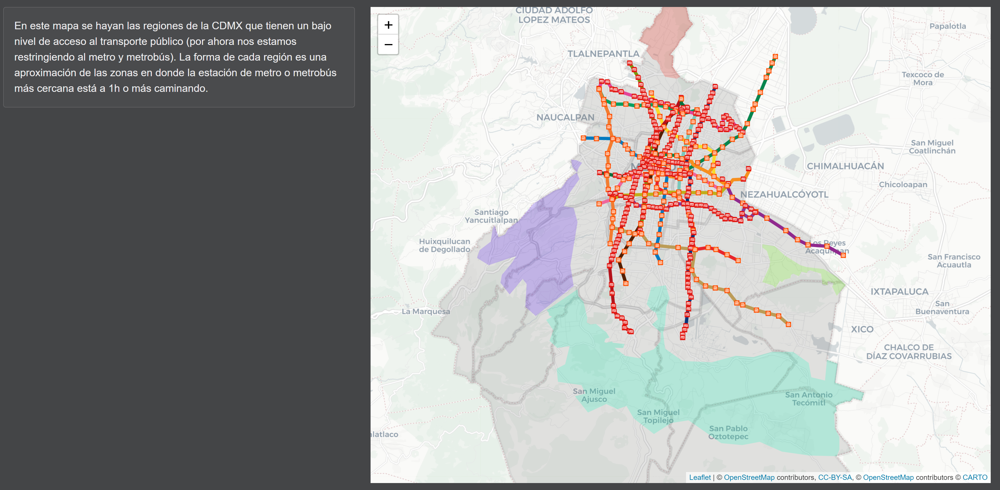

# CDMX Transportation Graphs
- [Contents](#contents)
- [Use](#use)
- [Sources and Support](#sources-and-support)

|              |                                                    |
|--------------|----------------------------------------------------|
| **Author:**  | Fabio G. Calo Dizy                                 |
| **License:** | [MIT](https://choosealicense.com/licenses/mit/)    |

###### Note: the app is currently only available in spanish.

## Contents
Here's a sample of some of the visualizations included in the app. Most of them are interactive.

### Metro

### Metrobús

### Private Transport

### Effects of the Pandemic

### Pollution

### Miscellaneous

## Use
Download this repo as a zip file, open "Shiny App.R" using RStudio and click on "Run App". 
The app will open in a browser tab. Make sure all the libraries listed at the top of the file
are installed.

## Credits and Support
Data used:

- Metro and Metrobús: SEMOVI (https://datos.cdmx.gob.mx/dataset/afluencia-diaria-del-metro-cdmx and https://datos.cdmx.gob.mx/dataset/afluencia-diaria-de-metrobus-cdmx)
- Private transport:  Waze (https://datos.cdmx.gob.mx/dataset/movilidad-historico-covid-19) and TomTom (https://corporate.tomtom.com/static-files/7b98ada1-ec2c-4da0-8579-f83ac0f31d88)
- Pollution: INEGI (https://www.inegi.org.mx/temas/ee/)
- Geographic data: Google Maps and geojson.io

For any suggestions, bug reports or inquiries, contact me at fcalodizy@gmail.com.
